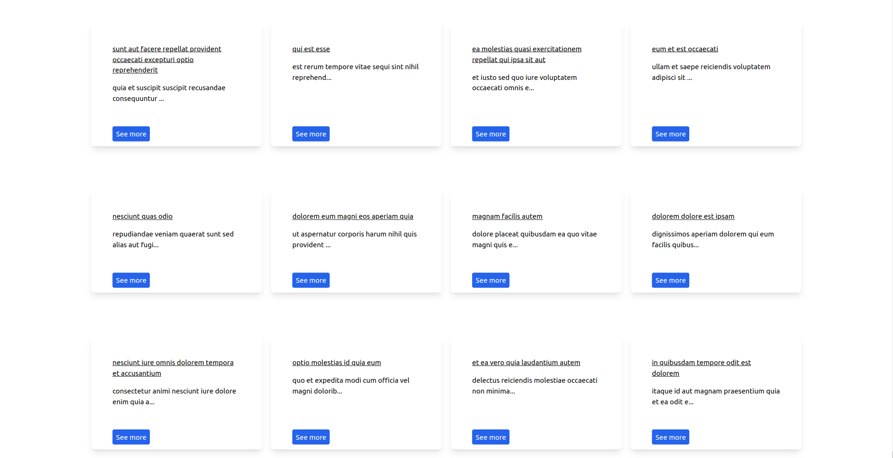

## Table of Contents

- [Table of Contents](#table-of-contents)
- [App looks like](#app-looks-like)
- [Prerequisites](#prerequisites)
- [Install And Run](#install-and-run)
- [Resources](#resources)

## App looks like



## Prerequisites
| #        | NAME     | VERSION        | Check Version |
| :---     | :---:    |     :---:      |       :---: |
|          | <a href="https://getcomposer.org/" target=_blank>composer</a> | ^2.1.8     | comopser --version    |
|          | <a href="https://nodejs.org/en/" target=_blank>node</a>     | ^16.13.0     | node -v     |
|          | <a href="https://docs.npmjs.com/cli/v8/configuring-npm/install" target=_blank>npm</a>    | ^8.3.1       | npm -v      |
|          | <a href="https://www.mysql.com/" target=_blank>MySql</a> | 8.0.30     | mysql --version   |


## Install And Run

Download [ZIP](https://github.com/davitlabadze/iliauni-challenge/archive/refs/heads/master.zip)
or
clone
```
git clone https://github.com/davitlabadze/iliauni-challenge.git
```

Composer install
```
composer i
```
Copy .env file
```
cp .env.example .env
```
Key Generate
```
php artisan key:generate
```
Run Migrations

```
php artisan migrate
```

Fetch Post data and insert in database
```
php artisan post:generate
```

Install Npm
```
npm i
```

Build Project
```
npm run build
```
Run Project
```
php artisan serve
```

## Resources

* [API](https://jsonplaceholder.typicode.com/)
